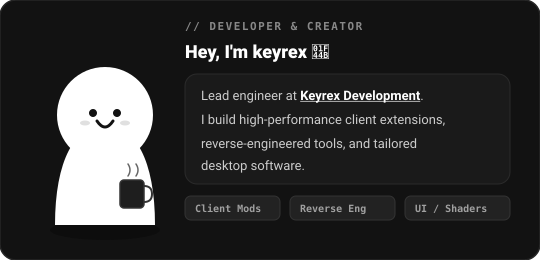
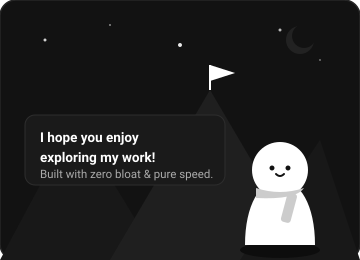
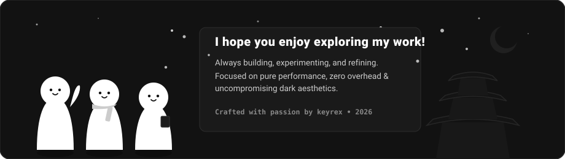

<table width="100%" align="center" border="0" cellspacing="10" cellpadding="0">
  <!-- ROW 1: ABOUT & VIBE -->
  <tr>
    <td width="58%" valign="top">
      
    </td>
    <td width="42%" valign="top">
      
    </td>
  </tr>

  <!-- ROW 2: LARGE SCENERY BANNER -->
  <tr>
    <td colspan="2" width="100%" valign="top">
      
    </td>
  </tr>
</table>

---

### ✦ Selected Works

| Project | Description | Stack | Status |
| :--- | :--- | :--- | :--- |
| **[KeyWare DMs](https://github.com/keyrexdevelopment/keyware-dms)** | Modular Direct Messages workspace for BetterDiscord. Featuring per-user sound dispatching, 0ms React-Safe DOM ordering, and real-time GPU shaders. | `JavaScript` `BetterDiscord` `CSS3` | `★ Active Release` |

---

  Crafted with precision by <b><a href="https://github.com/keyrexdevelopment">keyrex</a></b>. All systems operational.

