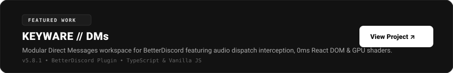

  

<table width="100%" align="center" border="0" cellspacing="10" cellpadding="0">
  <!-- ROW 1: ABOUT & WELCOME -->
  <tr>
    <td width="60%" valign="top">
      
    </td>
    <td width="40%" valign="top">
      
    </td>
  </tr>

  <!-- ROW 2: FEATURED WORK SHOWCASE -->
  <tr>
    <td colspan="2" width="100%" valign="top">
      
    </td>
  </tr>
</table>
