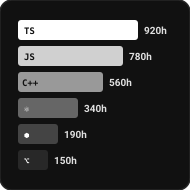

<table width="100%" align="center" border="0" cellspacing="10" cellpadding="0">
  <!-- ROW 1 -->
  <tr>
    <td width="48%" valign="top">
      
    </td>
    <td width="26%" valign="top">
      
    </td>
    <td width="26%" rowspan="2" valign="top">
      
    </td>
  </tr>

  <!-- ROW 2 -->
  <tr>
    <td width="24%" valign="top">
      
    </td>
    <td width="50%" valign="top">
      
    </td>
  </tr>

  <!-- ROW 3 -->
  <tr>
    <td width="26%" rowspan="2" valign="top">
      
    </td>
    <td width="48%" valign="top">
      
    </td>
    <td width="26%" valign="top">
      
    </td>
  </tr>

  <!-- ROW 4 -->
  <tr>
    <td colspan="2" valign="top">
      <table width="100%" border="0" cellspacing="0" cellpadding="0">
        <tr>
          <td width="33%" valign="top" style="padding-right: 5px;">
            
          </td>
          <td width="33%" valign="top" style="padding: 0 5px;">
            
          </td>
          <td width="33%" valign="top" style="padding-left: 5px;">
            
          </td>
        </tr>
      </table>
    </td>
  </tr>
</table>
