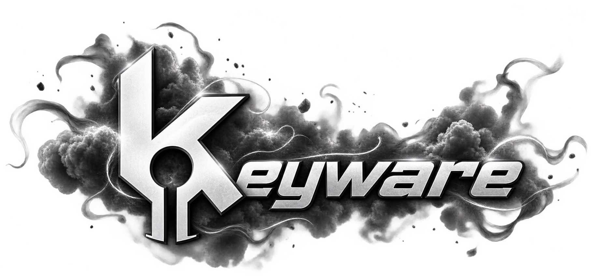

  

<table width="100%">
  <tr>
    <td width="58%" valign="top">
      <h3><code>✦</code> About Keyrex</h3>
      

        Independent software engineering collective specializing in client modifications, reverse-engineering, and tailored desktop architecture.
      

      

        Built on principles of zero-overhead execution, event-driven pipelines, and uncompromising dark aesthetics.
      

    </td>
    <td width="42%" valign="top">
      <h3><code>✦</code> Featured Release</h3>
      

        <b><a href="https://github.com/keyrexdevelopment/keyware-dms">KEYWARE // DMs</a></b> 
        Modular Direct Messages workspace for BetterDiscord featuring per-channel audio dispatch routing and GPU shader themes.
      

      

        <code>v5.8.1 • Stable Release</code>
      

    </td>
  </tr>
  <tr>
    <td colspan="2" align="center">
      <code>architecting next-generation client modifications & high-performance software.</code>
    </td>
  </tr>
</table>
